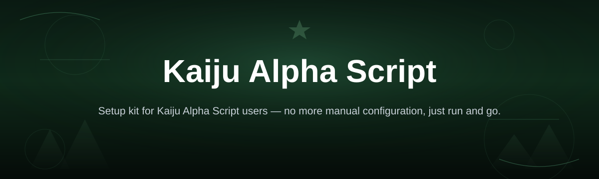

# kaiju-alpha-script-kit

*A tidy way for Windows users to run Kaiju Alpha Script without wrestling with setup steps.*

| At a glance | |
|---|---|
| OS | Windows 10 or 11 (64-bit) |
| Install | None — unpack, double-click, done |
| Toolchain | Not required — no compiler, no runtime, no dependencies |
| Disk space | Roughly 50 MB free |

## What this is

Kaiju Alpha Script is a lightweight script kit built for Windows desktops. This repository, **kaiju-alpha-script-kit**, is the home for its documentation and release notes — the actual build is distributed through the project's landing page rather than as source you compile yourself. If you searched for "Kaiju Alpha Script," this is the project you were looking for: a standalone kit, not a plugin, not a fork, not a rebrand of something else.

The kit is organized around a single idea — get you from download to a working session in under a minute, on a machine that has nothing special installed. There's no dependency chain to untangle and no configuration file to hand-edit before the first run. You unpack it, you launch it, and the interface is ready to use immediately.

  

The button above opens the project's landing page, where the current build of Kaiju Alpha Script is hosted for download.

## Who it is for

- **Windows users** who want a script kit that runs without setup friction.
- **First-time visitors** trying to confirm what Kaiju Alpha Script actually does before downloading it.
- **Casual tinkerers** who prefer a portable tool over an installer that writes to the registry.
- **Returning users** checking release notes or looking for the current download link.
- **Anyone comparing script kits** who wants a clear, honest description instead of marketing copy.

## What you can do

- **Launch instantly** — no install wizard, no admin prompts to click through.
- **Run it portably** — keep the folder on a USB drive or a synced cloud folder.
- **Navigate with a compact interface** designed to stay out of your way.
- **Trigger core actions with keybo